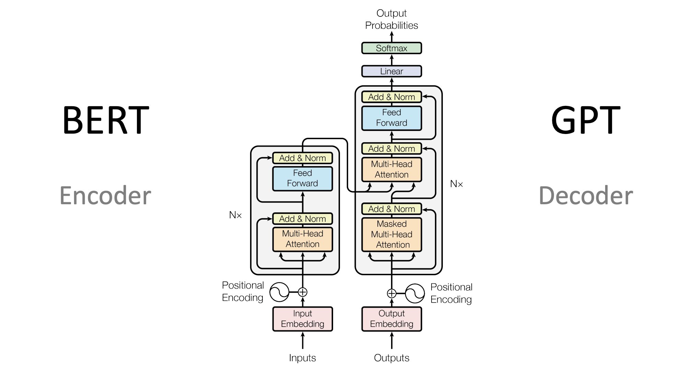

# 🚀 Transformer Architecture — Step-by-Step Summary

---

### **Step 1: Dataset Format**

- **Paired sentences**: Input → Output (e.g., English to French)
  ```
  "I love pizza"  →  "J’aime la pizza"
  ```

---

### **Step 2: Input Preprocessing**

- **Tokenization**: Convert words into tokens
- **Embeddings**: Each token becomes a vector
- **Positional Encoding**: Adds word order information to embeddings

---

### **Step 3: Encoder Process (Runs in Parallel)**

There are **6 encoder layers**, each with:

#### a. Multi-Head Self-Attention

- Computes Q (Query), K (Key), V (Value) for each token
- Attention scores determine how much each word should focus on others
- Multiple heads = multiple attention perspectives

#### b. Feed-Forward Neural Network (FNN)

- Refines each token’s vector individually

> 🔁 Output of one encoder is sent into the next encoder

→ Final result: Context-rich vectors for the input sentence

---

### **Step 4: Decoder Process (Runs Word-by-Word)**

There are **6 decoder layers**, each with:

#### a. Masked Multi-Head Self-Attention

- Looks only at previously generated words (prevents looking ahead)

#### b. Cross-Attention

- Decoder “looks at” encoder outputs to find relevant input words

#### c. Feed-Forward Neural Network (FNN)

- Further refines the decoder’s token vectors

> 🧱 Decoder starts with `<start>` token and generates **one word at a time**

---

### **Step 5: Output Generation (Autoregressive)**

- At each step, decoder generates the next word
- It uses:
  - Its own previous words (via masked attention)
  - The input sentence context (via cross-attention)
- Repeats until `<end>` token is generated

---

### **Step 6: Training**

- Uses **teacher forcing**: model is given the correct output words
- Loss is calculated by comparing predicted vs actual output
- All weights (encoders + decoders) are updated via backpropagation
  > 🔧 Weights = what the model “remembers” from training (its **experience**)

---

### **Step 7: Inference / Testing**

- Model sees **new input** (e.g., “I hate pizza”)
- Uses learned weights to generate output word-by-word
  > Applies its **learned patterns** to unseen data

---

# ✅ You Now Know:

- The full Transformer pipeline from input to output
- Encoder = parallel, Decoder = sequential
- Attention = core mechanism (Q, K, V, multi-head)
- Decoder uses input + previous output to predict next word
- Weights = memory / experience of the model

!

[alt text](1_D8HzNBM9Y1qZPveOFRE3sQ.webp)
